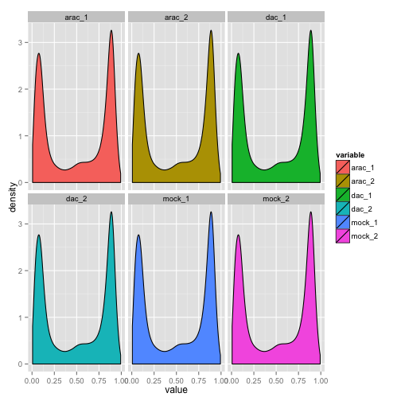
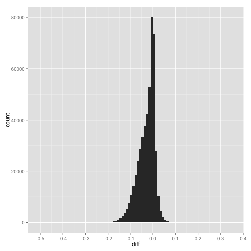
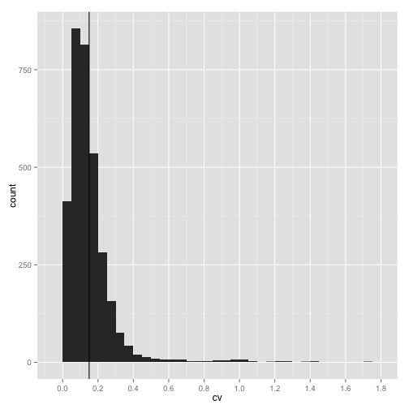

Effect of AraC and DAC on AML epigenomes
========================================================

This document was last updated at Tue Feb 24 14:53:37 2015 by Tony Hui

### If libraries aren't installed, install them first


```r
source("http://bioconductor.org/biocLite.R")
biocLite("GEOquery")
biocLite("wateRmelon")
biocLite("IlluminaHumanMethylation450k.db")
install.packages("ggplot2")
```

### Load the libraries (so we can use their functions) before starting analysis


```r
library(GEOquery)
library(wateRmelon)
library(IlluminaHumanMethylation450k.db)
library(ggplot2)
library(reshape2)
```

### Load the data from Gene Expression Omnibus (GEO)


```r
if (file.exists("methyl_all_Rdata")) {
    # if previously downloaded
    load("methyl_all_Rdata")
} else {
    # if downloading for the first time
    GSE40870 <- getGEO("GSE40870")

    # Extract expression matrices (turn into data frames at once)
    all_data <- as.data.frame(exprs(GSE40870[[1]]))

    # Obtain the meta-data for the samples, but only look at the important ones
    all_meta <- pData(phenoData(GSE40870[[1]]))
    subset_meta <- subset(all_meta, select = c("geo_accession", "characteristics_ch1.3", "characteristics_ch1.4", "characteristics_ch1.6", "characteristics_ch1.7"))
    
    # Clean up the data to remove words that we aren't interested in
    subset_meta_clean <- data.frame(
      geo_accession = subset_meta$geo_accession,
      gender = gsub(pattern = "gender: ", replacement = "", x = subset_meta$characteristics_ch1.3),
      age = gsub(pattern = "age: ([0-9]+).*", replacement = "\\1", x = subset_meta$characteristics_ch1.4),
      treatment = gsub(pattern = "treatment: ", replacement = "", x = subset_meta$characteristics_ch1.6),
      sample = gsub(pattern = "aml sample identifier: ", replacement = "", x = subset_meta$characteristics_ch1.7)
      )

    # save the data to avoid future re-downloading
    save(all_data, all_meta, subset_meta_clean, file = "methyl_all_Rdata")
}
```

### Look at what data we have avaliable


```r
#List of the metadata
subset_meta_clean
```

```
##     geo_accession gender age         treatment sample
## V2     GSM1003835   male  60 cytarabine (AraC) 410324
## V3     GSM1003836   male  60 cytarabine (AraC) 410324
## V4     GSM1003837   male  60  decitabine (DAC) 410324
## V5     GSM1003838   male  60  decitabine (DAC) 410324
## V6     GSM1003839   male  60              mock 410324
## V7     GSM1003840   male  60              mock 410324
## V8     GSM1003841   male  75 cytarabine (AraC) 632729
## V9     GSM1003842   male  75 cytarabine (AraC) 632729
## V10    GSM1003843   male  75  decitabine (DAC) 632729
## V11    GSM1003844   male  75  decitabine (DAC) 632729
## V12    GSM1003845   male  75              mock 632729
## V13    GSM1003846   male  75              mock 632729
## V14    GSM1003847 female  41 cytarabine (AraC) 721214
## V15    GSM1003848 female  41 cytarabine (AraC) 721214
## V16    GSM1003849 female  41  decitabine (DAC) 721214
## V17    GSM1003850 female  41  decitabine (DAC) 721214
## V18    GSM1003851 female  41              mock 721214
## V19    GSM1003852 female  41              mock 721214
## V20    GSM1003853 female  21 cytarabine (AraC) 737451
## V21    GSM1003854 female  21 cytarabine (AraC) 737451
## V22    GSM1003855 female  21  decitabine (DAC) 737451
## V23    GSM1003856 female  21  decitabine (DAC) 737451
## V24    GSM1003857 female  21              mock 737451
## V25    GSM1003858 female  21              mock 737451
## V26    GSM1003859   male  45 cytarabine (AraC) 775109
## V27    GSM1003860   male  45 cytarabine (AraC) 775109
## V28    GSM1003861   male  45  decitabine (DAC) 775109
## V29    GSM1003862   male  45  decitabine (DAC) 775109
## V30    GSM1003863   male  45              mock 775109
## V31    GSM1003864   male  45              mock 775109
## V32    GSM1003865 female  57 cytarabine (AraC) 831711
## V33    GSM1003866 female  57 cytarabine (AraC) 831711
## V34    GSM1003867 female  57  decitabine (DAC) 831711
## V35    GSM1003868 female  57  decitabine (DAC) 831711
## V36    GSM1003869 female  57              mock 831711
## V37    GSM1003870 female  57              mock 831711
## V38    GSM1003871 female  56 cytarabine (AraC) 869922
## V39    GSM1003872 female  56 cytarabine (AraC) 869922
## V40    GSM1003873 female  56  decitabine (DAC) 869922
## V41    GSM1003874 female  56  decitabine (DAC) 869922
## V42    GSM1003875 female  56              mock 869922
## V43    GSM1003876 female  56              mock 869922
## V44    GSM1003877 female  76 cytarabine (AraC) 989176
## V45    GSM1003878 female  76 cytarabine (AraC) 989176
## V46    GSM1003879 female  76  decitabine (DAC) 989176
## V47    GSM1003880 female  76  decitabine (DAC) 989176
## V48    GSM1003881 female  76              mock 989176
## V49    GSM1003882 female  76              mock 989176
```

```r
#Sneak peak of the actual data
head(all_data) #the head function allows you to look only at the first 6 rows, to give you an idea of what's happening - saves computing resources
```

```
##            GSM1003835 GSM1003836 GSM1003837 GSM1003838 GSM1003839
## cg00000029 0.09770362 0.08138439  0.1205529  0.1522029  0.1379017
## cg00000108 0.92334093 0.92794232  0.9103985  0.9341260  0.9334861
## cg00000109 0.88167387 0.88104226  0.8693466  0.8487024  0.8863865
## cg00000165 0.24567054 0.32602945  0.2770543  0.2762217  0.2867580
## cg00000236 0.64981141 0.72679873  0.6265281  0.6290299  0.6527885
## cg00000289 0.60572586 0.64946936  0.5899017  0.5910464  0.6512940
##            GSM1003840 GSM1003841 GSM1003842 GSM1003843 GSM1003844
## cg00000029  0.1113193  0.5438691  0.5442738  0.4893308  0.5345305
## cg00000108  0.9276981  0.9457604  0.9351095  0.9206896  0.9229902
## cg00000109  0.9199523  0.9036431  0.8789942  0.8649255  0.8646798
## cg00000165  0.3057312  0.1727575  0.1723752  0.1819357  0.1684314
## cg00000236  0.7345921  0.8687549  0.8687459  0.8448829  0.8105711
## cg00000289  0.6400911  0.7534166  0.6971614  0.6985608  0.6391624
##            GSM1003845 GSM1003846 GSM1003847 GSM1003848 GSM1003849
## cg00000029  0.4578337  0.5357979  0.3655092  0.4097847  0.3549954
## cg00000108  0.9471890  0.9507958  0.9265152  0.9401920  0.9116125
## cg00000109  0.9126546  0.9092872  0.9161088  0.9001012  0.8640296
## cg00000165  0.1432203  0.1451639  0.2087321  0.2455311  0.1869702
## cg00000236  0.8632048  0.8783532  0.7973236  0.8193012  0.7863102
## cg00000289  0.7093994  0.7259917  0.7324086  0.7785059  0.6306634
##            GSM1003850 GSM1003851 GSM1003852 GSM1003853 GSM1003854
## cg00000029  0.3940475  0.3303158  0.4097438  0.5665803  0.6762133
## cg00000108  0.9039871  0.9366198  0.9335556  0.9260097  0.9243585
## cg00000109  0.8550239  0.8950968  0.9103764  0.9157250  0.8918366
## cg00000165  0.2365971  0.2010690  0.2284960  0.5797420  0.5984302
## cg00000236  0.7714201  0.8205036  0.8299365  0.7236037  0.7279613
## cg00000289  0.6687886  0.6946350  0.7239822  0.7321501  0.7266089
##            GSM1003855 GSM1003856 GSM1003857 GSM1003858 GSM1003859
## cg00000029  0.5094310  0.5540379  0.5597647  0.5679505  0.6876582
## cg00000108  0.8769244  0.8859094  0.9427976  0.9675966  0.9512618
## cg00000109  0.8844061  0.8375194  0.8989786  0.9141005  0.9230442
## cg00000165  0.5339080  0.6002981  0.5501785  0.6282725  0.2137327
## cg00000236  0.6522467  0.6665461  0.7250342  0.7703430  0.9038859
## cg00000289  0.6519782  0.6261162  0.7531270  0.7705719  0.7359851
##            GSM1003860 GSM1003861 GSM1003862 GSM1003863 GSM1003864
## cg00000029  0.7054418  0.4970208  0.4915650  0.6858658  0.6420273
## cg00000108  0.9492522  0.7621606  0.8653043  0.9500611  0.9528432
## cg00000109  0.9259927  0.7093359  0.7436197  0.9157322  0.9363831
## cg00000165  0.2187896  0.2321971  0.2395928  0.2107447  0.1971541
## cg00000236  0.8920759  0.7184575  0.7399974  0.9090078  0.8995231
## cg00000289  0.7177719  0.6388473  0.6028262  0.7334017  0.7465076
##            GSM1003865 GSM1003866 GSM1003867 GSM1003868 GSM1003869
## cg00000029  0.9100832  0.8694798  0.7772407  0.8380676  0.8830101
## cg00000108  0.9425785  0.9305893  0.9303567  0.9051529  0.9376853
## cg00000109  0.9070825  0.9277536  0.8640025  0.8611570  0.9281281
## cg00000165  0.2076115  0.1847291  0.2266397  0.1878423  0.1984504
## cg00000236  0.8439385  0.8646058  0.8142227  0.8090898  0.8466210
## cg00000289  0.7387161  0.7402843  0.7318098  0.6942558  0.7881759
##            GSM1003870 GSM1003871 GSM1003872 GSM1003873 GSM1003874
## cg00000029  0.9050922  0.6751064  0.6461420  0.5583681  0.5916006
## cg00000108  0.9720369  0.9452376  0.9352419  0.8906831  0.8961511
## cg00000109  0.9426385  0.9382293  0.9198907  0.8258370  0.7959850
## cg00000165  0.1767423  0.5367246  0.5007469  0.4884229  0.4929143
## cg00000236  0.8490504  0.8852432  0.8642556  0.8206809  0.8345827
## cg00000289  0.7396987  0.7939193  0.8106650  0.6910598  0.7201343
##            GSM1003875 GSM1003876 GSM1003877 GSM1003878 GSM1003879
## cg00000029  0.6838534  0.6901250  0.6630602  0.6442612  0.5739895
## cg00000108  0.9405450  0.9387307  0.9164805  0.9374955  0.8918096
## cg00000109  0.8946916  0.9253815  0.9141626  0.9427712  0.8638737
## cg00000165  0.5065914  0.4954049  0.1894454  0.1801841  0.1947675
## cg00000236  0.8916527  0.8818564  0.8693238  0.8816780  0.8662885
## cg00000289  0.7691863  0.7751595  0.7413030  0.8562813  0.7571723
##            GSM1003880 GSM1003881 GSM1003882
## cg00000029  0.6110825  0.5892823  0.6083358
## cg00000108  0.9236228  0.9304715  0.9613598
## cg00000109  0.9040147  0.8925043  0.9393362
## cg00000165  0.2203279  0.1894841  0.2187752
## cg00000236  0.8743838  0.8769099  0.9187089
## cg00000289  0.7462470  0.7245192  0.8418942
```

### Grab the dataset we're interested in (in this case, when the sample ID is 410324 - we should get 6 samples (2 control, 2 AraC, 2 Dac))


```r
#grab the GEO of the datasets of interest
dataset_interest_metadata <- subset(subset_meta_clean, sample == 410324)
dataset_interest <- subset(all_data, select = dataset_interest_metadata$geo_accession)
dataset_interest_metadata
```

```
##    geo_accession gender age         treatment sample
## V2    GSM1003835   male  60 cytarabine (AraC) 410324
## V3    GSM1003836   male  60 cytarabine (AraC) 410324
## V4    GSM1003837   male  60  decitabine (DAC) 410324
## V5    GSM1003838   male  60  decitabine (DAC) 410324
## V6    GSM1003839   male  60              mock 410324
## V7    GSM1003840   male  60              mock 410324
```

### Rename the columns to their appropriate sample names (NO MORE NORMALIZATION)


```r
# rename columns into appropiate samples
colnames(dataset_interest) <- c("arac_1","arac_2","dac_1","dac_2","mock_1","mock_2")
```

Do a quick plot of the Beta Values to make sure everything is working okay


```r
dataset_interest_melt <- melt(dataset_interest)
```

```
## No id variables; using all as measure variables
```

```r
ggplot(dataset_interest_melt, aes(x=value, fill=variable))+
  facet_wrap(~variable)+
  geom_density(binwidth=0.05)
```

 

Average the two replicates for each condition, and compute a "variance" (essentially how "far apart" the two replicates are)


```r
# find the averages of each group and store in a new data frame
data_summary <- data.frame(
  probe_id = rownames(dataset_interest),
  arac_mean= rowMeans(dataset_interest[,c("arac_1","arac_2")]),
  arac_variance = abs(dataset_interest$arac_1-dataset_interest$arac_2)/2,
  dac_mean = rowMeans(dataset_interest[,c("dac_1","dac_2")]),
  dac_variance = abs(dataset_interest$dac_1-dataset_interest$dac_2)/2,
  mock_mean = rowMeans(dataset_interest[,c("mock_1","mock_2")]),
  mock_variance = abs(dataset_interest$mock_1-dataset_interest$mock_2)/2
)
```

### Find the differentially methylated CpG's

Example: DAC vs control


```r
#create a new data frame to store differences
dacVScontrol <- data.frame(
  probe_id=rownames(data_summary),
  diff=data_summary$dac_mean-data_summary$mock_mean, #when we do DAC-control, negative values means that DAC is less methylated compared to control
  variance=data_summary$dac_variance+data_summary$mock_variance #from phys101: when dealing with error, always add them
  )
dacVScontrol$cv <- abs(dacVScontrol$variance/dacVScontrol$diff) #coefficient of variation, essentially telling what percent of the difference between two samples may be due to random error
```

Let's quickly plot the degree of difference to see what we're dealing with


```r
ggplot(dacVScontrol, aes(x=diff))+
  geom_bar(binwidth=0.01)+
  scale_x_continuous(breaks=seq(from = -1, to = 1, by = 0.1))
```

 

Looks like not many CpG's are different. Let's remove everything that's less than 5% (0.05) different to see the rest of the data-points.


```r
dacVScontrol_subset <- subset(dacVScontrol, abs(diff)>0.05) #subset rows with absolute value > 0.05

# make a quick plot
ggplot(dacVScontrol_subset, aes(x=diff))+
  geom_bar(binwidth=0.01)+
  scale_x_continuous(breaks=seq(from = -1, to = 1, by = 0.05))
```

 

This looks much more informative. It looks like DAC, for the most part, decreaeses the methylation of CpGs. However, there does seem to be some that are increased in methylation. We can also kind-of conclucde that 30% difference is probably the maximum difference we're going to see.

Let's now make an arbitrary cutoff - we're going to call any difference above 15% significant. Now, let's grab the cpg probes that are different by signifcant (differ by at least 15%). 

We probably want differences that are actually significant, so we might want CpG's with a cv of less than some fracion. But to decide on this cutoff, we're going to need to see a plot first.


```r
#grab the cpg probes
dacVScontrol_cutoff <- subset(dacVScontrol, abs(diff)>0.15)

#make a quick plot
ggplot(dacVScontrol_cutoff, aes(cv))+
  geom_bar(binwidth=0.05)+
  geom_vline(xintercept=0.15)+
  scale_x_continuous(breaks=seq(from = 0, to = 2, by = 0.2))
```

 

We see a good number of CpG's where the variance can account for the difference in methylation values (cv=1), so obviously these are no good. From the graph, it looks like 15% coefficient of variance (cv) is a good cutoff (black line).


```r
dacVScontrol_cutoff_significant <- subset(dacVScontrol_cutoff, cv < 0.15)
nrow(dacVScontrol_cutoff_significant)
```

```
## [1] 2082
```

Looks like we have 352 CpG's left. We can now do some annotation using the Illumina 450k database. For example, let's see what is avaliable.


```r
ls("package:IlluminaHumanMethylation450k.db")
```

```
##  [1] "IlluminaHumanMethylation450k"                  
##  [2] "IlluminaHumanMethylation450k_dbconn"           
##  [3] "IlluminaHumanMethylation450k_dbfile"           
##  [4] "IlluminaHumanMethylation450k_dbInfo"           
##  [5] "IlluminaHumanMethylation450k_dbschema"         
##  [6] "IlluminaHumanMethylation450k_get27k"           
##  [7] "IlluminaHumanMethylation450k_getControls"      
##  [8] "IlluminaHumanMethylation450k_getProbeOrdering" 
##  [9] "IlluminaHumanMethylation450k_getProbes"        
## [10] "IlluminaHumanMethylation450kACCNUM"            
## [11] "IlluminaHumanMethylation450kALIAS2PROBE"       
## [12] "IlluminaHumanMethylation450kBLAME"             
## [13] "IlluminaHumanMethylation450kBUILD"             
## [14] "IlluminaHumanMethylation450kCHR"               
## [15] "IlluminaHumanMethylation450kCHR36"             
## [16] "IlluminaHumanMethylation450kCHR37"             
## [17] "IlluminaHumanMethylation450kCHRLENGTHS"        
## [18] "IlluminaHumanMethylation450kCHRLOC"            
## [19] "IlluminaHumanMethylation450kCHRLOCEND"         
## [20] "IlluminaHumanMethylation450kCOLORCHANNEL"      
## [21] "IlluminaHumanMethylation450kCPG36"             
## [22] "IlluminaHumanMethylation450kCPG37"             
## [23] "IlluminaHumanMethylation450kCPGCOORDINATE"     
## [24] "IlluminaHumanMethylation450kCPGILOCATION"      
## [25] "IlluminaHumanMethylation450kCPGINAME"          
## [26] "IlluminaHumanMethylation450kCPGIRELATION"      
## [27] "IlluminaHumanMethylation450kCPGS"              
## [28] "IlluminaHumanMethylation450kDESIGN"            
## [29] "IlluminaHumanMethylation450kDHS"               
## [30] "IlluminaHumanMethylation450kDMR"               
## [31] "IlluminaHumanMethylation450kENHANCER"          
## [32] "IlluminaHumanMethylation450kENSEMBL"           
## [33] "IlluminaHumanMethylation450kENSEMBL2PROBE"     
## [34] "IlluminaHumanMethylation450kENTREZID"          
## [35] "IlluminaHumanMethylation450kENZYME"            
## [36] "IlluminaHumanMethylation450kENZYME2PROBE"      
## [37] "IlluminaHumanMethylation450kFANTOM"            
## [38] "IlluminaHumanMethylation450kGENEBODY"          
## [39] "IlluminaHumanMethylation450kGENENAME"          
## [40] "IlluminaHumanMethylation450kGO"                
## [41] "IlluminaHumanMethylation450kGO2ALLPROBES"      
## [42] "IlluminaHumanMethylation450kGO2PROBE"          
## [43] "IlluminaHumanMethylation450kISCPGISLAND"       
## [44] "IlluminaHumanMethylation450kMAP"               
## [45] "IlluminaHumanMethylation450kMAPCOUNTS"         
## [46] "IlluminaHumanMethylation450kMETHYL27"          
## [47] "IlluminaHumanMethylation450kNUID"              
## [48] "IlluminaHumanMethylation450kOMIM"              
## [49] "IlluminaHumanMethylation450kORGANISM"          
## [50] "IlluminaHumanMethylation450kORGPKG"            
## [51] "IlluminaHumanMethylation450kPATH"              
## [52] "IlluminaHumanMethylation450kPATH2PROBE"        
## [53] "IlluminaHumanMethylation450kPFAM"              
## [54] "IlluminaHumanMethylation450kPMID"              
## [55] "IlluminaHumanMethylation450kPMID2PROBE"        
## [56] "IlluminaHumanMethylation450kPROBELOCATION"     
## [57] "IlluminaHumanMethylation450kPROSITE"           
## [58] "IlluminaHumanMethylation450kRANDOM"            
## [59] "IlluminaHumanMethylation450kREFSEQ"            
## [60] "IlluminaHumanMethylation450kREGULATORYGROUP"   
## [61] "IlluminaHumanMethylation450kREGULATORYLOCATION"
## [62] "IlluminaHumanMethylation450kREGULATORYNAME"    
## [63] "IlluminaHumanMethylation450kSVNID"             
## [64] "IlluminaHumanMethylation450kSYMBOL"            
## [65] "IlluminaHumanMethylation450kUNIGENE"           
## [66] "IlluminaHumanMethylation450kUNIPROT"
```

Let's look at gene associations. We're going to use the Ensembl database, which is a collection of all 20,000 human genes and their genomic locations. Ensembl is jointly coordinated by the Sanger Institute and the European Bioinformatics Institute, located in Cambridge, UK (google Ensembl to learn more).


```r
# grab the table
ensembl_genes <- as.data.frame(IlluminaHumanMethylation450kENSEMBL)

# merge our probe list with the ensembl genes
dacVScontrol_annotation <- merge(ensembl_genes, dacVScontrol_cutoff_significant, by="probe_id")

#count the occurances of each ensembl id
dacVScontrol_annotation_occuranges <- as.data.frame(table(dacVScontrol_annotation$ensembl_id))
dacVScontrol_annotation_occuranges <- dacVScontrol_annotation_occuranges[order(dacVScontrol_annotation_occuranges$Freq, decreasing=T),]

#see the top 6 genes
head(dacVScontrol_annotation_occuranges)
```

```
##                Var1 Freq
## 392 ENSG00000157985   25
## 381 ENSG00000155093   15
## 107 ENSG00000104714   13
## 142 ENSG00000112562   12
## 212 ENSG00000130508   12
## 591 ENSG00000186487   12
```

Looks like the top three most affected genes are: ENSG00000157985, ENSG00000155093, ENSG00000104714.


