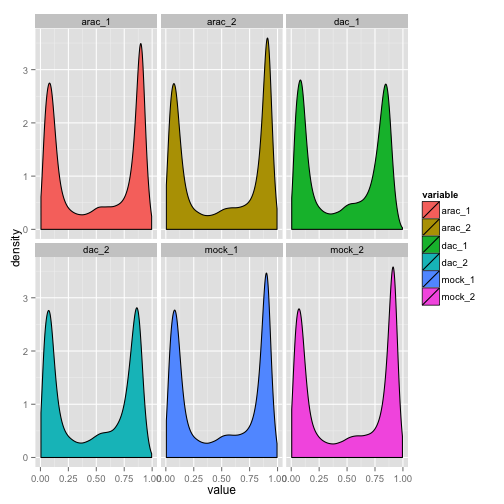
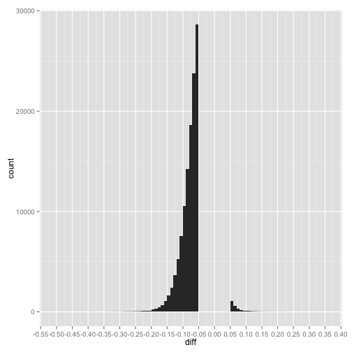

Effect of AraC and DAC on AML epigenomes
========================================================

This document was last updated at Mon Feb 23 17:09:31 2015 by Tony Hui

### If libraries aren't installed, install them first


```r
source("http://bioconductor.org/biocLite.R")
biocLite("GEOquery")
biocLite("wateRmelon")
biocLite("IlluminaHumanMethylation450k.db")
install.packages("ggplot2")
```

### Load the libraries (so we can use their functions) before starting analysis


```r
library(GEOquery)
library(wateRmelon)
library(IlluminaHumanMethylation450k.db)
```

```
## Warning: 'IlluminaHumanMethylation450k.db' is deprecated.
## Use 'FDb.InfiniumMethylation.hg19' instead.
## Use 'FDb.InfiniumMethylation.hg18' instead.
## Use 'mapToGenome() function in minfi or methylumi' instead.
## See help("Deprecated")
```

```r
library(ggplot2)
library(reshape2)
```

### Load the data from Gene Expression Omnibus (GEO)


```r
if (file.exists("methyl_all_Rdata")) {
    # if previously downloaded
    load("methyl_all_Rdata")
} else {
    # if downloading for the first time
    GSE40870 <- getGEO("GSE40870")

    # Extract expression matrices (turn into data frames at once)
    all_data <- as.data.frame(exprs(GSE40870[[1]]))

    # Obtain the meta-data for the samples, but only look at the important ones
    all_meta <- pData(phenoData(GSE40870[[1]]))
    subset_meta <- subset(all_meta, select = c("geo_accession", "characteristics_ch1.3", "characteristics_ch1.4", "characteristics_ch1.6", "characteristics_ch1.7"))
    
    # Clean up the data to remove words that we aren't interested in
    subset_meta_clean <- data.frame(
      geo_accession = subset_meta$geo_accession,
      gender = gsub(pattern = "gender: ", replacement = "", x = subset_meta$characteristics_ch1.3),
      age = gsub(pattern = "age: ([0-9]+).*", replacement = "\\1", x = subset_meta$characteristics_ch1.4),
      treatment = gsub(pattern = "treatment: ", replacement = "", x = subset_meta$characteristics_ch1.6),
      sample = gsub(pattern = "aml sample identifier: ", replacement = "", x = subset_meta$characteristics_ch1.7)
      )

    # save the data to avoid future re-downloading
    save(all_data, all_meta, subset_meta_clean, file = "methyl_all_Rdata")
}
```

### Look at what data we have avaliable


```r
subset_meta_clean
```

```
##     geo_accession gender age         treatment sample
## V2     GSM1003835   male  60 cytarabine (AraC) 410324
## V3     GSM1003836   male  60 cytarabine (AraC) 410324
## V4     GSM1003837   male  60  decitabine (DAC) 410324
## V5     GSM1003838   male  60  decitabine (DAC) 410324
## V6     GSM1003839   male  60              mock 410324
## V7     GSM1003840   male  60              mock 410324
## V8     GSM1003841   male  75 cytarabine (AraC) 632729
## V9     GSM1003842   male  75 cytarabine (AraC) 632729
## V10    GSM1003843   male  75  decitabine (DAC) 632729
## V11    GSM1003844   male  75  decitabine (DAC) 632729
## V12    GSM1003845   male  75              mock 632729
## V13    GSM1003846   male  75              mock 632729
## V14    GSM1003847 female  41 cytarabine (AraC) 721214
## V15    GSM1003848 female  41 cytarabine (AraC) 721214
## V16    GSM1003849 female  41  decitabine (DAC) 721214
## V17    GSM1003850 female  41  decitabine (DAC) 721214
## V18    GSM1003851 female  41              mock 721214
## V19    GSM1003852 female  41              mock 721214
## V20    GSM1003853 female  21 cytarabine (AraC) 737451
## V21    GSM1003854 female  21 cytarabine (AraC) 737451
## V22    GSM1003855 female  21  decitabine (DAC) 737451
## V23    GSM1003856 female  21  decitabine (DAC) 737451
## V24    GSM1003857 female  21              mock 737451
## V25    GSM1003858 female  21              mock 737451
## V26    GSM1003859   male  45 cytarabine (AraC) 775109
## V27    GSM1003860   male  45 cytarabine (AraC) 775109
## V28    GSM1003861   male  45  decitabine (DAC) 775109
## V29    GSM1003862   male  45  decitabine (DAC) 775109
## V30    GSM1003863   male  45              mock 775109
## V31    GSM1003864   male  45              mock 775109
## V32    GSM1003865 female  57 cytarabine (AraC) 831711
## V33    GSM1003866 female  57 cytarabine (AraC) 831711
## V34    GSM1003867 female  57  decitabine (DAC) 831711
## V35    GSM1003868 female  57  decitabine (DAC) 831711
## V36    GSM1003869 female  57              mock 831711
## V37    GSM1003870 female  57              mock 831711
## V38    GSM1003871 female  56 cytarabine (AraC) 869922
## V39    GSM1003872 female  56 cytarabine (AraC) 869922
## V40    GSM1003873 female  56  decitabine (DAC) 869922
## V41    GSM1003874 female  56  decitabine (DAC) 869922
## V42    GSM1003875 female  56              mock 869922
## V43    GSM1003876 female  56              mock 869922
## V44    GSM1003877 female  76 cytarabine (AraC) 989176
## V45    GSM1003878 female  76 cytarabine (AraC) 989176
## V46    GSM1003879 female  76  decitabine (DAC) 989176
## V47    GSM1003880 female  76  decitabine (DAC) 989176
## V48    GSM1003881 female  76              mock 989176
## V49    GSM1003882 female  76              mock 989176
```

### Grab the dataset we're interested in (in this case, when the sample ID is 410324 - we should get 6 samples (2 control, 2 AraC, 2 Dac))


```r
#grab the GEO of the datasets of interest
dataset_interest_metadata <- subset(subset_meta_clean, sample == 410324)
dataset_interest <- subset(all_data, select = dataset_interest_metadata$geo_accession)
dataset_interest_metadata
```

```
##    geo_accession gender age         treatment sample
## V2    GSM1003835   male  60 cytarabine (AraC) 410324
## V3    GSM1003836   male  60 cytarabine (AraC) 410324
## V4    GSM1003837   male  60  decitabine (DAC) 410324
## V5    GSM1003838   male  60  decitabine (DAC) 410324
## V6    GSM1003839   male  60              mock 410324
## V7    GSM1003840   male  60              mock 410324
```

### Normalize the data and average the control/AraC/Dac replicates


```r
# normalization
dataset_interest_normalized <- betaqn(dataset_interest)

# rename columns into appropiate samples
colnames(dataset_interest_normalized) <- c("arac_1","arac_2","dac_1","dac_2","mock_1","mock_2")
```

Do a quick plot of the Beta Values to make sure everything is working okay


```r
dataset_interest_normalized_melt <- melt(dataset_interest_normalized)
```

```
## No id variables; using all as measure variables
```

```r
ggplot(dataset_interest_normalized_melt, aes(x=value, fill=variable))+
  facet_wrap(~variable)+
  geom_density(binwidth=0.05)
```

 

Average the two replicates for each condition, and compute a "variance" (essentially how "far apart" the two replicates are)


```r
# find the averages of each group and store in a new data frame
data_summary <- data.frame(
  probe_id = rownames(dataset_interest_normalized),
  arac_mean= rowMeans(dataset_interest_normalized[,c("arac_1","arac_2")]),
  arac_variance = abs(dataset_interest_normalized$arac_1-dataset_interest_normalized$arac_2)/2,
  dac_mean = rowMeans(dataset_interest_normalized[,c("dac_1","dac_2")]),
  dac_variance = abs(dataset_interest_normalized$dac_1-dataset_interest_normalized$dac_2)/2,
  mock_mean = rowMeans(dataset_interest_normalized[,c("mock_1","mock_2")]),
  mock_variance = abs(dataset_interest_normalized$mock_1-dataset_interest_normalized$mock_2)/2
)
```

### Find the differentially methylated CpG's

Example: DAC vs control


```r
#create a new data frame to store differences
dacVScontrol <- data.frame(
  probe_id=rownames(data_summary),
  diff=data_summary$dac_mean-data_summary$mock_mean, #when we do DAC-control, negative values means that DAC is less methylated compared to control
  variance=data_summary$dac_variance+data_summary$mock_variance #from phys101: when dealing with error, always add them
  )
dacVScontrol$cv <- abs(dacVScontrol$variance/dacVScontrol$diff) #coefficient of variation, essentially telling what percent of the difference between two samples may be due to random error
```

Let's quickly plot the degree of difference to see what we're dealing with


```r
ggplot(dacVScontrol, aes(x=diff))+
  geom_bar(binwidth=0.01)+
  scale_x_continuous(breaks=seq(from = -1, to = 1, by = 0.1))
```

 

Looks like not many CpG's are different. Let's remove everything that's less than 5% (0.05) different to see the rest of the data-points.


```r
dacVScontrol_subset <- subset(dacVScontrol, abs(diff)>0.05) #subset rows with absolute value > 0.05

# make a quick plot
ggplot(dacVScontrol_subset, aes(x=diff))+
  geom_bar(binwidth=0.01)+
  scale_x_continuous(breaks=seq(from = -1, to = 1, by = 0.05))
```

 

This looks much more informative. It looks like DAC, for the most part, decreaeses the methylation of CpGs. However, there does seem to be some that are increased in methylation. We can also kind-of conclucde that 30% difference is probably the maximum difference we're going to see.

Let's now make an arbitrary cutoff - we're going to call any difference above 15% significant. Now, let's grab the cpg probes that are different by signifcant (differ by at least 15%). 

We probably want differences that are actually significant, so we might want CpG's with a cv of less than some fracion. But to decide on this cutoff, we're going to need to see a plot first.


```r
#grab the cpg probes
dacVScontrol_cutoff <- subset(dacVScontrol, abs(diff)>0.15)

#make a quick plot
ggplot(dacVScontrol_cutoff, aes(cv))+
  geom_bar(binwidth=0.05)+
  geom_vline(xintercept=0.15)+
  scale_x_continuous(breaks=seq(from = 0, to = 2, by = 0.2))
```

 

We see a good number of CpG's where the variance can account for the difference in methylation values (cv=1), so obviously these are no good. From the graph, it looks like 15% coefficient of variance (cv) is a good cutoff (black line).


```r
dacVScontrol_cutoff_significant <- subset(dacVScontrol_cutoff, cv < 0.15)
nrow(dacVScontrol_cutoff_significant)
```

```
## [1] 352
```

Looks like we have 352 CpG's left. We can now do some annotation using the Illumina 450k database. For example, let's see what is avaliable.


```r
ls("package:IlluminaHumanMethylation450k.db")
```

```
##  [1] "IlluminaHumanMethylation450k"                  
##  [2] "IlluminaHumanMethylation450k_dbconn"           
##  [3] "IlluminaHumanMethylation450k_dbfile"           
##  [4] "IlluminaHumanMethylation450k_dbInfo"           
##  [5] "IlluminaHumanMethylation450k_dbschema"         
##  [6] "IlluminaHumanMethylation450k_get27k"           
##  [7] "IlluminaHumanMethylation450k_getControls"      
##  [8] "IlluminaHumanMethylation450k_getProbeOrdering" 
##  [9] "IlluminaHumanMethylation450k_getProbes"        
## [10] "IlluminaHumanMethylation450kACCNUM"            
## [11] "IlluminaHumanMethylation450kALIAS2PROBE"       
## [12] "IlluminaHumanMethylation450kBLAME"             
## [13] "IlluminaHumanMethylation450kBUILD"             
## [14] "IlluminaHumanMethylation450kCHR"               
## [15] "IlluminaHumanMethylation450kCHR36"             
## [16] "IlluminaHumanMethylation450kCHR37"             
## [17] "IlluminaHumanMethylation450kCHRLENGTHS"        
## [18] "IlluminaHumanMethylation450kCHRLOC"            
## [19] "IlluminaHumanMethylation450kCHRLOCEND"         
## [20] "IlluminaHumanMethylation450kCOLORCHANNEL"      
## [21] "IlluminaHumanMethylation450kCPG36"             
## [22] "IlluminaHumanMethylation450kCPG37"             
## [23] "IlluminaHumanMethylation450kCPGCOORDINATE"     
## [24] "IlluminaHumanMethylation450kCPGILOCATION"      
## [25] "IlluminaHumanMethylation450kCPGINAME"          
## [26] "IlluminaHumanMethylation450kCPGIRELATION"      
## [27] "IlluminaHumanMethylation450kCPGS"              
## [28] "IlluminaHumanMethylation450kDESIGN"            
## [29] "IlluminaHumanMethylation450kDHS"               
## [30] "IlluminaHumanMethylation450kDMR"               
## [31] "IlluminaHumanMethylation450kENHANCER"          
## [32] "IlluminaHumanMethylation450kENSEMBL"           
## [33] "IlluminaHumanMethylation450kENSEMBL2PROBE"     
## [34] "IlluminaHumanMethylation450kENTREZID"          
## [35] "IlluminaHumanMethylation450kENZYME"            
## [36] "IlluminaHumanMethylation450kENZYME2PROBE"      
## [37] "IlluminaHumanMethylation450kFANTOM"            
## [38] "IlluminaHumanMethylation450kGENEBODY"          
## [39] "IlluminaHumanMethylation450kGENENAME"          
## [40] "IlluminaHumanMethylation450kGO"                
## [41] "IlluminaHumanMethylation450kGO2ALLPROBES"      
## [42] "IlluminaHumanMethylation450kGO2PROBE"          
## [43] "IlluminaHumanMethylation450kISCPGISLAND"       
## [44] "IlluminaHumanMethylation450kMAP"               
## [45] "IlluminaHumanMethylation450kMAPCOUNTS"         
## [46] "IlluminaHumanMethylation450kMETHYL27"          
## [47] "IlluminaHumanMethylation450kNUID"              
## [48] "IlluminaHumanMethylation450kOMIM"              
## [49] "IlluminaHumanMethylation450kORGANISM"          
## [50] "IlluminaHumanMethylation450kORGPKG"            
## [51] "IlluminaHumanMethylation450kPATH"              
## [52] "IlluminaHumanMethylation450kPATH2PROBE"        
## [53] "IlluminaHumanMethylation450kPFAM"              
## [54] "IlluminaHumanMethylation450kPMID"              
## [55] "IlluminaHumanMethylation450kPMID2PROBE"        
## [56] "IlluminaHumanMethylation450kPROBELOCATION"     
## [57] "IlluminaHumanMethylation450kPROSITE"           
## [58] "IlluminaHumanMethylation450kRANDOM"            
## [59] "IlluminaHumanMethylation450kREFSEQ"            
## [60] "IlluminaHumanMethylation450kREGULATORYGROUP"   
## [61] "IlluminaHumanMethylation450kREGULATORYLOCATION"
## [62] "IlluminaHumanMethylation450kREGULATORYNAME"    
## [63] "IlluminaHumanMethylation450kSVNID"             
## [64] "IlluminaHumanMethylation450kSYMBOL"            
## [65] "IlluminaHumanMethylation450kUNIGENE"           
## [66] "IlluminaHumanMethylation450kUNIPROT"
```

Let's look at gene associations. We're going to use the Ensembl database, which is a collection of all 20,000 human genes and their genomic locations. Ensembl is jointly coordinated by the Sanger Institute and the European Bioinformatics Institute, located in Cambridge, UK (google Ensembl to learn more).


```r
# grab the table
ensembl_genes <- as.data.frame(IlluminaHumanMethylation450kENSEMBL)

# merge our probe list with the ensembl genes
dacVScontrol_annotation <- merge(ensembl_genes, dacVScontrol_cutoff_significant, by="probe_id")

#count the occurances of each ensembl id
dacVScontrol_annotation_occuranges <- as.data.frame(table(dacVScontrol_annotation$ensembl_id))
dacVScontrol_annotation_occuranges <- dacVScontrol_annotation_occuranges[order(dacVScontrol_annotation_occuranges$Freq, decreasing=T),]
dacVScontrol_annotation_occuranges
```

```
##                Var1 Freq
## 25  ENSG00000104714    7
## 64  ENSG00000157985    7
## 98  ENSG00000186487    6
## 6   ENSG00000068024    4
## 43  ENSG00000130508    4
## 1   ENSG00000032389    3
## 13  ENSG00000080854    3
## 71  ENSG00000167632    3
## 99  ENSG00000187537    3
## 125 ENSG00000266795    3
## 128 ENSG00000270375    3
## 130 ENSG00000276399    3
## 5   ENSG00000066032    2
## 14  ENSG00000083857    2
## 16  ENSG00000090920    2
## 24  ENSG00000104044    2
## 29  ENSG00000112685    2
## 33  ENSG00000115705    2
## 50  ENSG00000145113    2
## 55  ENSG00000150403    2
## 58  ENSG00000151962    2
## 62  ENSG00000155093    2
## 73  ENSG00000170819    2
## 74  ENSG00000171045    2
## 87  ENSG00000182095    2
## 88  ENSG00000182667    2
## 90  ENSG00000183169    2
## 108 ENSG00000218336    2
## 129 ENSG00000275395    2
## 2   ENSG00000046774    1
## 3   ENSG00000049618    1
## 4   ENSG00000060709    1
## 7   ENSG00000069998    1
## 8   ENSG00000072832    1
## 9   ENSG00000074181    1
## 10  ENSG00000075886    1
## 11  ENSG00000077522    1
## 12  ENSG00000078177    1
## 15  ENSG00000087258    1
## 17  ENSG00000100031    1
## 18  ENSG00000100852    1
## 19  ENSG00000102572    1
## 20  ENSG00000102683    1
## 21  ENSG00000103111    1
## 22  ENSG00000103227    1
## 23  ENSG00000103494    1
## 26  ENSG00000109906    1
## 27  ENSG00000112562    1
## 28  ENSG00000112584    1
## 30  ENSG00000112893    1
## 31  ENSG00000114251    1
## 32  ENSG00000114861    1
## 34  ENSG00000118407    1
## 35  ENSG00000118596    1
## 36  ENSG00000123066    1
## 37  ENSG00000124302    1
## 38  ENSG00000124490    1
## 39  ENSG00000125207    1
## 40  ENSG00000126217    1
## 41  ENSG00000128578    1
## 42  ENSG00000130226    1
## 44  ENSG00000130821    1
## 45  ENSG00000131018    1
## 46  ENSG00000137266    1
## 47  ENSG00000141448    1
## 48  ENSG00000142611    1
## 49  ENSG00000143450    1
## 51  ENSG00000146555    1
## 52  ENSG00000146648    1
## 53  ENSG00000147454    1
## 54  ENSG00000149435    1
## 56  ENSG00000150893    1
## 57  ENSG00000151952    1
## 59  ENSG00000152076    1
## 60  ENSG00000153303    1
## 61  ENSG00000153495    1
## 63  ENSG00000155792    1
## 65  ENSG00000163032    1
## 66  ENSG00000163510    1
## 67  ENSG00000164113    1
## 68  ENSG00000164330    1
## 69  ENSG00000164484    1
## 70  ENSG00000166351    1
## 72  ENSG00000168412    1
## 75  ENSG00000171773    1
## 76  ENSG00000171847    1
## 77  ENSG00000171853    1
## 78  ENSG00000172428    1
## 79  ENSG00000172554    1
## 80  ENSG00000173876    1
## 81  ENSG00000175470    1
## 82  ENSG00000175806    1
## 83  ENSG00000179023    1
## 84  ENSG00000180475    1
## 85  ENSG00000181090    1
## 86  ENSG00000181867    1
## 89  ENSG00000183117    1
## 91  ENSG00000183206    1
## 92  ENSG00000183580    1
## 93  ENSG00000183666    1
## 94  ENSG00000183715    1
## 95  ENSG00000183826    1
## 96  ENSG00000184258    1
## 97  ENSG00000185736    1
## 100 ENSG00000188185    1
## 101 ENSG00000188760    1
## 102 ENSG00000196581    1
## 103 ENSG00000198033    1
## 104 ENSG00000204175    1
## 105 ENSG00000204689    1
## 106 ENSG00000206474    1
## 107 ENSG00000215374    1
## 109 ENSG00000220550    1
## 110 ENSG00000221900    1
## 111 ENSG00000224234    1
## 112 ENSG00000225725    1
## 113 ENSG00000227888    1
## 114 ENSG00000229412    1
## 115 ENSG00000230505    1
## 116 ENSG00000232397    1
## 117 ENSG00000233803    1
## 118 ENSG00000234749    1
## 119 ENSG00000235441    1
## 120 ENSG00000235597    1
## 121 ENSG00000237375    1
## 122 ENSG00000260807    1
## 123 ENSG00000261456    1
## 124 ENSG00000262722    1
## 126 ENSG00000268982    1
## 127 ENSG00000269277    1
```

Looks like the top three most affected genes are: ENSG00000104714, ENSG00000157985, ENSG00000186487.
