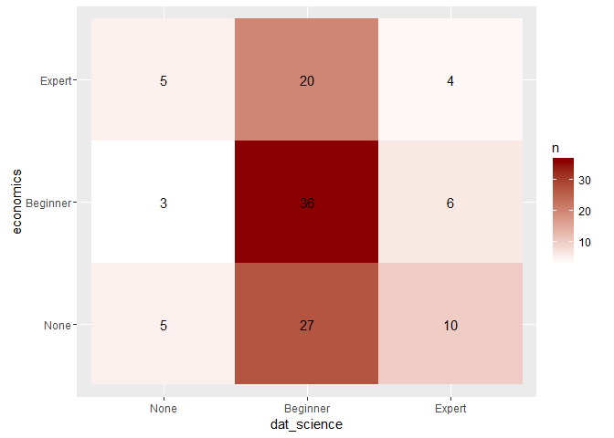
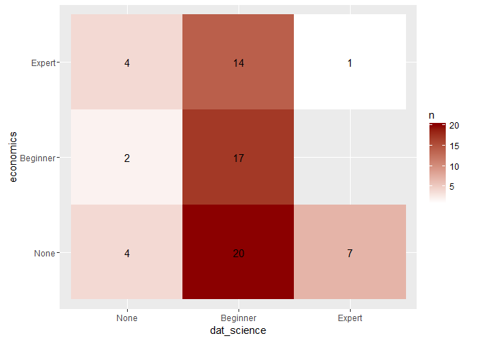
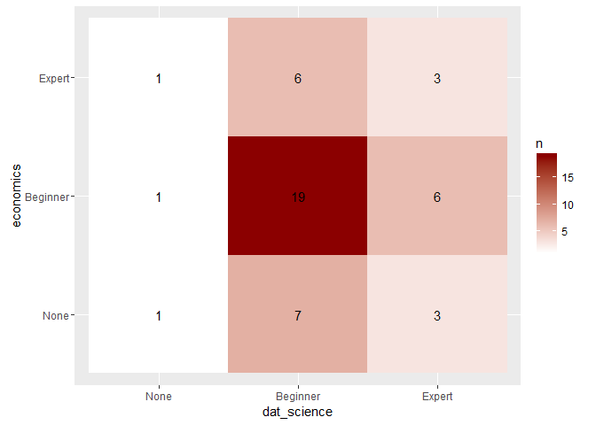
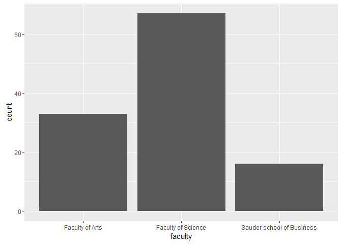
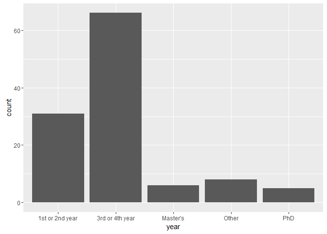
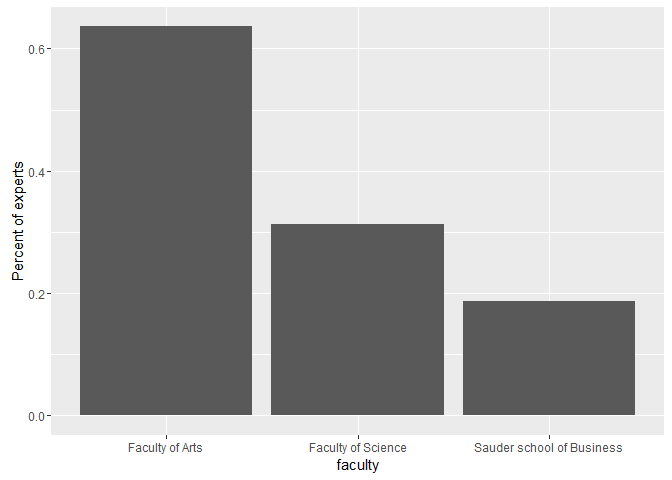
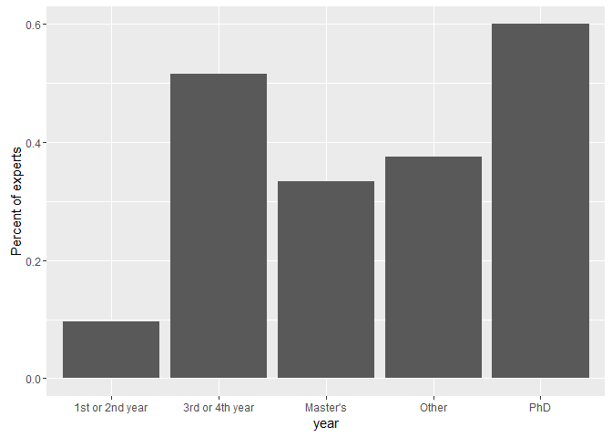

# Participantdat
Tony Hui  
March 2, 2016  


## Do people need teams?


```
## Source: local data frame [2 x 2]
## 
##    team     n
##   (lgl) (int)
## 1 FALSE    47
## 2  TRUE    69
```

## What skill level is everybody?



## What skill level is people looking for teams



## What skill level is people not looking for teams



## What faculty are people coming from?



## What year is everybody in?



## Which faculty has highest percentage of experts?



## Experts by year



