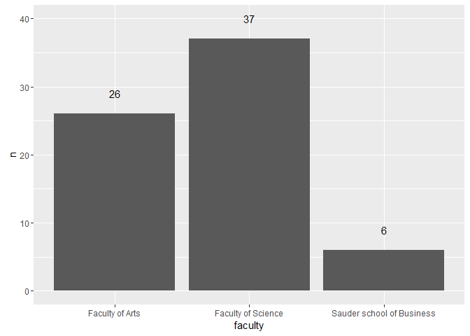

# Participant data for Big Data Big Impact
Tony Hui  
March 2, 2016  

Competition information: http://makedatasense.ca/data-science-competition/#econdata

We asked:

* What faculty are you in? 
* How much experience do you have with Economics/International Policy? 
* How much experience do you have with Data Science?
* Are you looking for a team?
* What year are you in

## How many people need teams?

## What skill level is everybody?

## What skill level are people who are looking for teams?

## What skill level are people not looking for teams?

## What faculty are people coming from?

## What year is everybody in?

## Which faculty has highest percentage of experts?

## Experts by year

