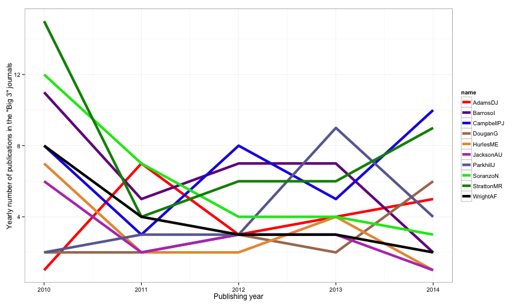

### Why am I doing this?

For the upcomming interview at the PhD open day at the Sanger Institute, I'm supposed to interview 1 on 1 with three faculty members. I get to rank my top 6 choices. 

My primary goal during my PhD is to get as many publications as possible, and idealy within the "Big 3" journals (Nature, Science, or Cell). I also hope to be with a lab that does cancer research, lots of bioinformatics, and colaborates a lot. Hopefully, by analysing the publication records of the various labs at the Sanger, maybe I will be able to make some more informed decisions.

### Now for the Analysis


First, take a look at the raw data of publications of all faculty members (extracted from the Sanger website's "publication" section):


```
##          name 2010 2011 2012 2013 2014
## 10    AdamsDJ    1    7    3    4    5
## 11   AdamskiJ    1    1    0    0    0
## 36 AndersonCA    3    3    3    2    0
## 37 ANDERSONCA    1    0    0    0    0
## 38  AndersonR    1    0    0    0    0
## 39  AndersonW    2    0    0    0    0
```

Now, let's melt the data.frame to prepare for ggplot plotting:


```
##         name total rank year count cumsum
## 6    AdamsDJ    20    6 2010     1      1
## 7    AdamsDJ    20    6 2011     7      8
## 8    AdamsDJ    20    6 2012     3     11
## 9    AdamsDJ    20    6 2013     4     15
## 10   AdamsDJ    20    6 2014     5     20
## 111 BarrosoI    32    3 2010    11     11
```

First, have a look at cumulative number of publications since 2010 for the top 10 publishing faculty members. For now, let's only count publications that were in published in Nature, Science or Cell.

 

Looks like Dr. Stratton (Cancer Genome Project) is leading the way with most "big 3" publications since 2010. Following him is Dr. Campbell (Cancer Genome Project) at #2, Dr. Barroso (Metabolic disease group) at #3, and Dr. Soranzo (Genomics of quantitative variation) at #4.

If we look at the number of publications per year, we can see if any labs have any publishing "momentum." 

 

Interestingly, it looks like 2010 was a great year for the Sanger Institute, but it was followed by a "slump" year in 2011. It also looks like Dr. Stratton and Dr. Campbell (both Cancer Genome Project) have been publishing a lot recently.


Now, let's take a look at the cumulative sum of publications, but now counting all journal articles rather than only counting articles published within the "big 3."

 

The clear leader here is Dr. Parkhill (Pathogen Genomics) at #1. Dr. Dougan (Microbial pathogenesis) and Dr. Adams (Experimental cancer genetics) are trailing behind at #2 and #3.

Once again, let's look at the number of publications per year. 

 

Looks like Dr. Parkhill (Pathogen genomics) has been publishing a lot recently! Dr. Dougan (Microbial Pathogenesis), Dr. Berriman (Parasite Genomics), and Dr. Campbell (Cancer Genome Project) have also been increasing in output recently. Actually, it appears that everybody in the top 10 are increasing publications in the last 2 years. Probably a very good time to join the Sanger Institute.

Let's look at the ratio of big3 publications versus total publications might tell me which lab primarily publishes big. Let's plot the total number of publications and the number of "big3" publications together, and sort by the ratio. To remove noise, let's remove anybody with less than 10 total publications since 2010.

 

Looks like Dr. Wright (Cell surface signalling laboratory) leads the pack with Dr. Anderson (Genomics of inflammation and immunity) following close behind. However, it appears that the ratios are almost a uniform distribution, so this metric is probably not too impactful unless the rankings are far apart (3-4 places). Let's look at their "publication curves":

 

It appears that researchers tend to publish more "big3" journals first at the beginning of their career, then "branch off" to other journals - perhaps that's how they started their careers to get tenure?

It also makes Dr. Stratton, Dr. Campbell and Dr. Barrosol much more impressive - the previous bar plot shows that these three labs are still within the top 10 in terms of proportion of papers landing in the "big3" journals, while this line graph shows an increasing gap of "big3" papers versus total papers as time progresses. Impressive that these three researchers can maintain the gap!

Anyways, time to pick 6 faculty members to interview with.

### Rankings

1. Dr. Peter Campbell
    + Does technology development (my specialty), so may be keen on doing single-cell work as well. Consistantly publishes well (rank 2 in big3, rank 1 in big3 rate), and is increasing in output in recent years. 
2. Dr. Michael Stratton
    + Lots of papers and also publishing at an increasing rate (rank 1 in big3, rank 2 in big3 rate). Head of the institute, and found BRCA2 mutations.
3. Dr. Carl Anderson
    + He is early in his career, and seems to publish a high proportion of "big 3" journals (rank 2 in ratio), and does a lot of statistics. Immunology and genetics are an interesting combination as well.
4. Dr. Jeffrey Barrett
    + Very rich profile - involved in a million collaborations. He was also was at MIT doing computer science, which is very impressive. Lots of statistical modelling here.
5. Dr. Nicole Soranzo
    + Does open chromatin stuff - perhaps ATAC-seq is next? Publishes well, although on the decline
6. Dr. Wolf Reik if possible, if not then Dr. Ultan McDermott
    + Cancer genomics, and although he didn't make any of the lists, his reserach is interesting and involves cancer
    

    

